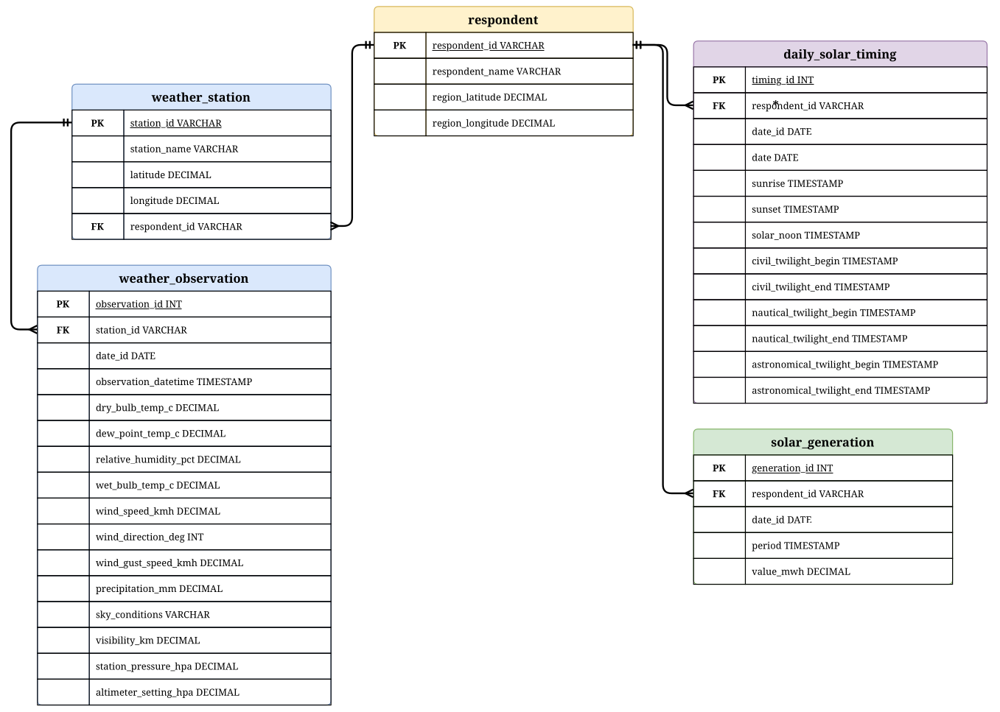

# Solar Energy Data Pipeline

A full-stack data pipeline that integrates solar generation, weather, and sunrise/sunset data for the California (CISO) and Texas (ERCO) grid regions. Data is pulled from three APIs, cleaned, loaded into PostgreSQL, and served through a Flask API with a React dashboard.

## Data Sources

- **EIA API v2** - Hourly solar generation (MWh) by region
- **NOAA NCEI** - Hourly weather observations (temperature, humidity, wind, etc.)
- **Sunrise-Sunset API** - Daily sunrise/sunset times and day length

## Prerequisites

- [Docker](https://docs.docker.com/get-docker/) and Docker Compose

No other software is required.

## Quick Start

1. Clone the repository and navigate to the project directory:

```bash
cd DataEngProject
```

2. Copy the provided `.env` file into the project root directory. This file contains the database credentials and API keys needed to run the pipeline.

3. Build and start all services:

```bash
docker compose up -d --build
```

This starts three containers:
- **db** - PostgreSQL 15 (Alpine Linux) on port 5432
- **backend** - Flask API (Python 3.13, Debian Slim) on port 5000
- **frontend** - React dashboard (Node 18, Alpine Linux) on port 3000

4. Run the data pipeline:

```bash
docker compose exec backend python scripts/run_pipeline.py
```

This will:
- Load historical data from the bundled CSV files into PostgreSQL
- Pull fresh solar generation data from the EIA API to fill any gap between the CSV cutoff and today
- Pull fresh sunrise/sunset data from the Sunrise-Sunset API to bring both regions current
- Build and refresh materialized views for the dashboard

5. Open the dashboard at [http://localhost:3000](http://localhost:3000)

The API is available at [http://localhost:5000/api/health](http://localhost:5000/api/health)

## Database Schema

The database is normalized to 3NF with five tables. Date-derived fields (day of week, month name, season, etc.) and day length are computed in SQL views and queries rather than stored.



| Table | Description |
|---|---|
| `respondent` | Grid region metadata (CISO and ERCO) with name and coordinates |
| `weather_station` | NOAA weather station details (name, location) linked to a respondent |
| `solar_generation` | Hourly solar generation in MWh from the EIA, linked to a respondent |
| `weather_observation` | Hourly weather readings (temperature, humidity, wind, pressure, visibility, precipitation, sky conditions) linked to a station |
| `daily_solar_timing` | Daily sunrise/sunset times, solar noon, and twilight times for each respondent |

The pipeline also creates two materialized views used by the API:

| View | Description |
|---|---|
| `daily_summary` | Aggregates solar generation, weather, and daylight data per region per day |
| `monthly_summary` | Rolls up daily_summary into monthly totals and averages |

A merged view (`merged_weather_solar_view`) joins all five tables for ad-hoc analysis.

## API Endpoints

| Endpoint | Description |
|---|---|
| `GET /api/health` | Health check |
| `GET /api/overview` | Aggregate statistics (total MWh, averages, peak) |
| `GET /api/solar/daily` | Daily solar generation with weather |
| `GET /api/solar/hourly` | Hourly generation for a specific day |
| `GET /api/solar/monthly` | Monthly aggregated generation |
| `GET /api/solar/comparison` | Side-by-side CISO vs ERCO comparison |
| `GET /api/weather/daily` | Daily weather metrics |
| `GET /api/correlation/solar-weather` | Solar vs weather correlation analysis |
| `GET /api/correlation/solar-daylight` | Solar vs daylight correlation analysis |
| `GET /api/daylight` | Sunrise/sunset times with daily generation |

Most endpoints accept optional query parameters: `region` (CISO or ERCO), `start_date`, `end_date`.

## Stopping the Services

```bash
docker compose down
```

To also remove the database volume and start fresh:

```bash
docker compose down -v
```

